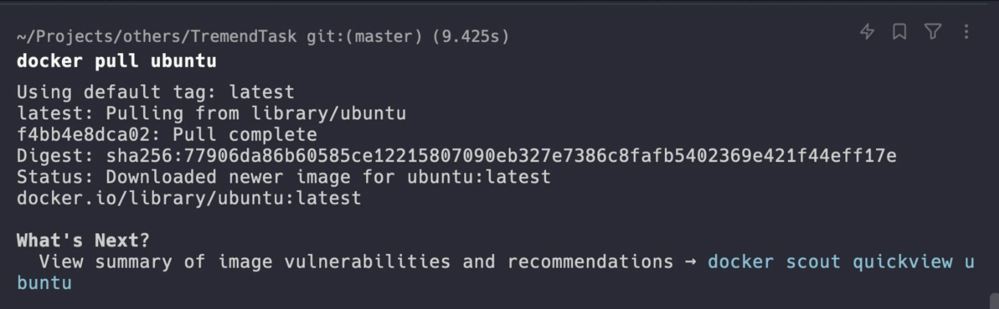
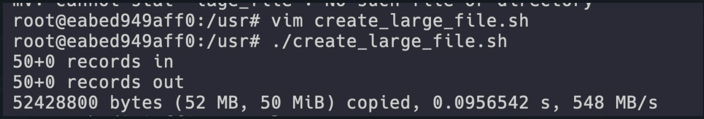
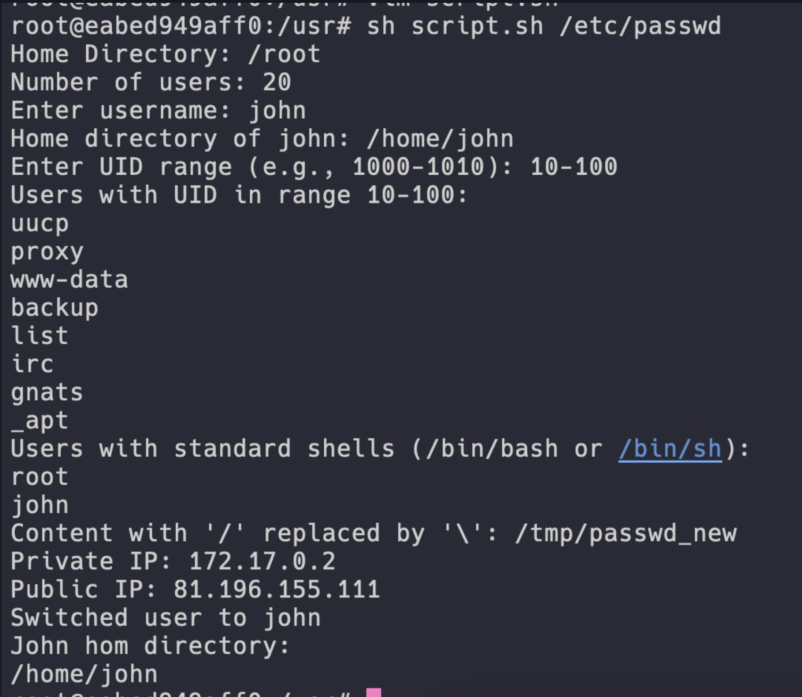
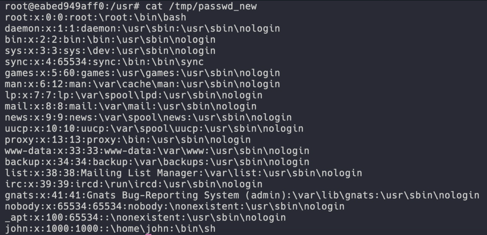
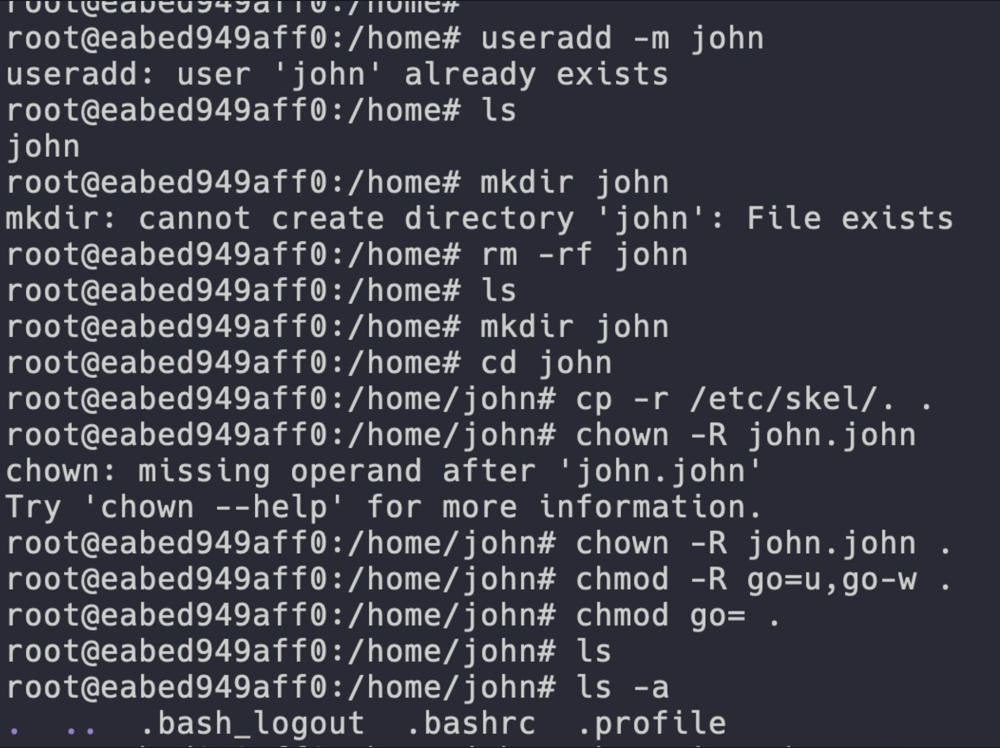

# Task 1

## 1.1

I had Docker Desktop together with the docker engine already installed on my system. I had to pull the image for ubuntu from a registry and run it. I used the following command to pull the image :



Also used the following command to run the image and start the container:

```
docker run -it --name ubuntu ubuntu
```

## 1.2

I created the user named "john" inside the ubuntu container using the following command:

```
adduser john
```

and copied and succesfully ran the script file inside the container. There was a typo in the script file for the name of the large_file but I corrected and then ran the script file using the following command:



## 1.3

I have wrote a bash script for the requiered task names "script.sh". The script file is present in the Task1 directory. 

### Some of the outputs of the script file are as follows:



### The file temporarily created in the /tmp as passwd_new 





## Challenges and issues faced:

> 1. The home directory for the user "john" was not created by default. I had to manually create the home directory for the user "john". However, the script I first ran already made a directory named "john" in the home directory. I had to delete the directory and then create the home directory for the user "john" using the following commands:

<br/>



> 2. The script file had a typo in the name of the large file. I had to correct the name of the large file in the script file.

> 3. The requirement say that I have to change the user to john and then show its home directory. This does not work as the script terminates before reaching the function to display the home directory. When you switch users using su - john, it opens a new shell session as the "john" user, and any commands after that line won't be executed until you exit the "john" session and return to the original session. I had to use the flag "-c" in order to execute the command as the user "john" and then display the home directory.

```
su - john -c "echo ~john"
```
