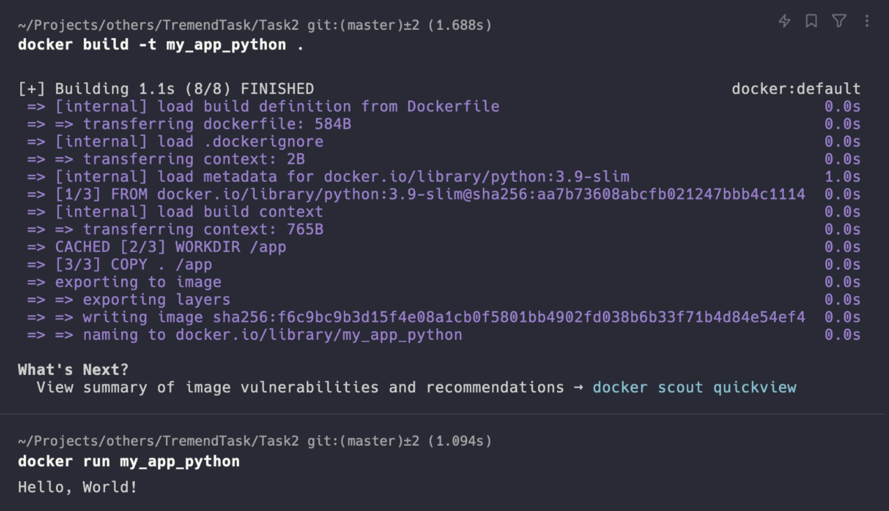
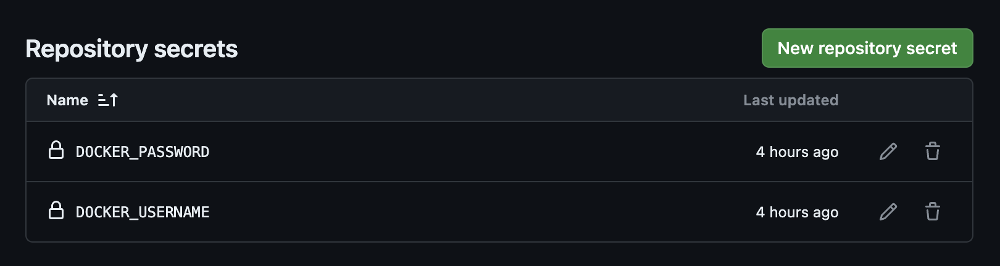
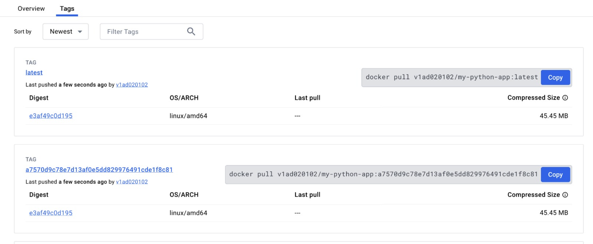

# Task 2

### I chose to use the pyhton app for this task.

I have successfully created a docker image using the Dockerfile. The Dockerfile is present in the Task2 directory. The image is named "my_app_pyhton". The image is created using the following command:

```
docker build -t my_app_python .
```

I have also successfully run the container using the following command:

```
docker run -it --name my_app_python my_app_python
```



### I have also created a new docker repository on Docker Hub called "my_app_python".

I have made a yaml file called "my_app_python.yaml" which is present in the Task2 directory. This file is used but Github Actions to build and push the image to the Docker Hub every time there are changes to the main or master branch. The file is also present in the .github/workflows directory.

I have also configured the secrets in the Github repository to store the Docker Hub username and password. The secrets are named "DOCKER_USERNAME" and "DOCKER_PASSWORD". These secrets are used in the yaml file to login to the Docker Hub and push the image.





### The script also pushes the new image with 2 tags: 
> 1. The first tag is "latest".
> 2. The second tag is the commit hash of the latest commit.
