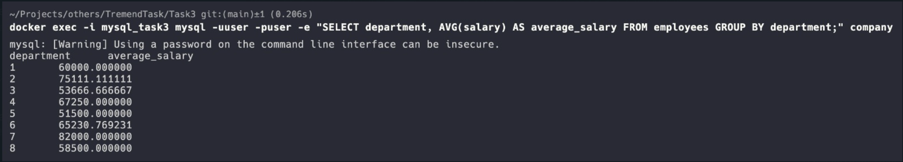

# Task 3

I have used a docker compose file to run the container for the mysql service. I have set the environment variables for the root password and the database name. The file is present in the Task3 directory. The file is used to run the container using the following command:

```
docker compose up -d
```

### I have also granted the newly created user all the privileges on the database. The command is as follows:

```
docker exec -i mysql_task3 mysql -uroot -proot -e "GRANT ALL PRIVILEGES ON company.* TO 'user'@'%';"
docker exec -i mysql_task3 mysql -uroot -proot -e "FLUSH PRIVILEGES;"
```

After this I have used the company.sql file to populate the database. The file is present in the Task3 directory. The command is as follows:

```
docker exec -i mysql_task3 mysql -uroot -proot company < company.sql
```
> ISSUE: There was a mistake in the seeder file. For the employess, the "department" column for one of them didn't had the id of the department, rather their name as a string. I have fixed the issue and the result is as follows:

Finally, using the newly created user, I have queried the database with the required result. The command is:



### BONUS:
I have also created a volume for the mysql container. This was created in the compose file and it is called: "mysql_data". 
It is used to "share" the data between the host and the container.
